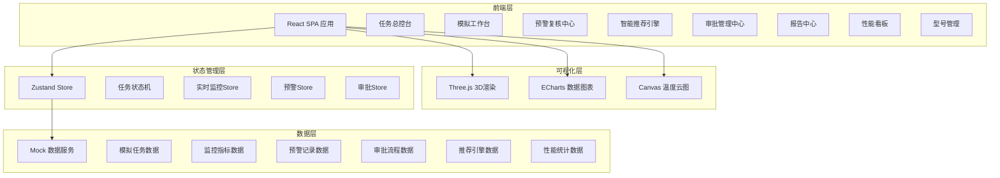
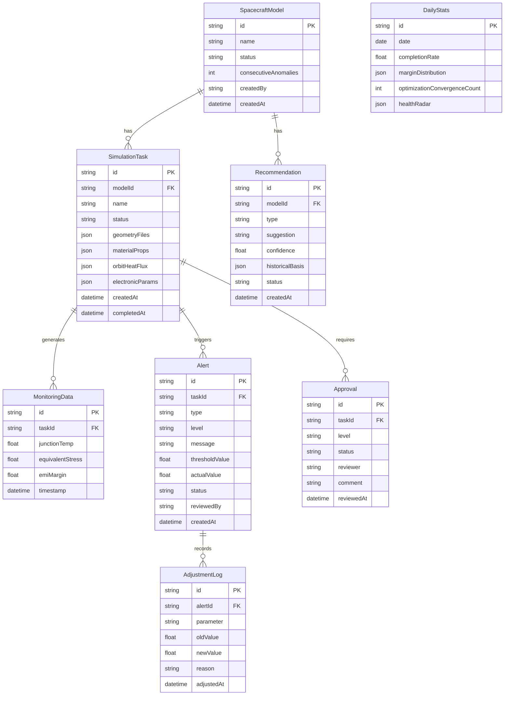

## 1. 架构设计



## 2. 技术说明

- **前端框架**：React@18 + TypeScript
- **样式方案**：Tailwind CSS@3 + CSS Modules（复杂动画）
- **构建工具**：Vite
- **路由**：React Router@6
- **状态管理**：Zustand（轻量级，适合复杂状态机）
- **三维渲染**：Three.js + @react-three/fiber + @react-three/drei + @react-three/postprocessing
- **数据可视化**：ECharts（仪表盘、雷达图、趋势曲线、热力图）
- **PDF生成**：html2canvas + jsPDF（客户端生成报告PDF）
- **动画**：Framer Motion（页面切换、组件动画、微交互）
- **图标**：Lucide React（线性图标）
- **后端**：无（纯前端 + Mock数据模拟全流程）
- **数据库**：无（使用Mock数据 + localStorage持久化）

## 3. 路由定义

| 路由 | 用途 |
|------|------|
| `/` | 重定向至任务总控台 |
| `/dashboard` | 任务总控台，展示任务列表与状态流转 |
| `/simulation/:id` | 模拟工作台，参数上传、3D预览、实时监控 |
| `/simulation/:id/monitor` | 实时监控面板（温度/应力/EMI仪表盘） |
| `/alerts` | 预警复核中心 |
| `/recommendations` | 智能推荐引擎 |
| `/approvals` | 审批管理中心 |
| `/reports` | 报告中心 |
| `/performance` | 性能看板（每日统计与雷达图） |
| `/models` | 型号管理 |

## 4. 数据模型

### 4.1 数据模型定义



### 4.2 关键类型定义

```typescript
type TaskStatus = 
  | 'pending_verification'
  | 'mesh_generation'
  | 'thermal_solving'
  | 'stress_analysis'
  | 'emc_evaluation'
  | 'life_prediction'
  | 'completed'
  | 'error_rollback'

type AlertLevel = 'info' | 'warning' | 'critical' | 'emergency'
type AlertType = 'temperature' | 'stress' | 'emi'
type ApprovalLevel = 'thermal_expert' | 'chief_engineer'
type ApprovalStatus = 'pending' | 'approved' | 'rejected'
type ModelStatus = 'active' | 'suspended'
type RecommendationType = 'heat_sink_wingspan' | 'insulation_layers' | 'cable_shielding'
```
